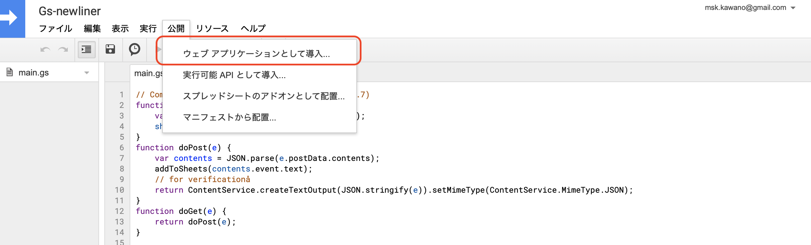
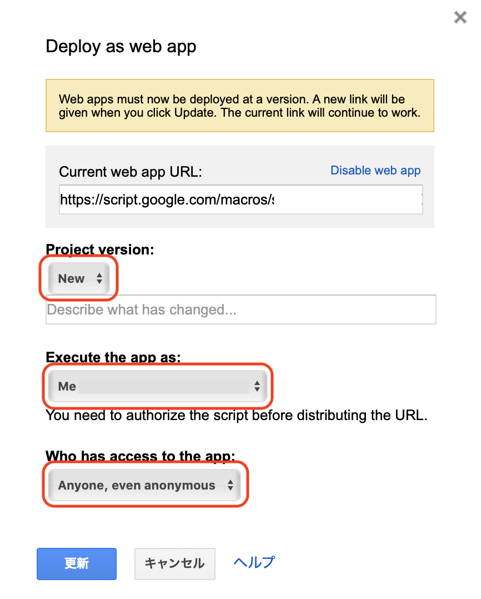
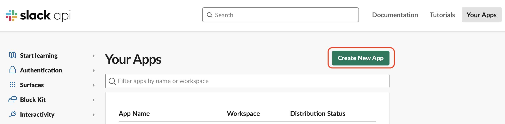
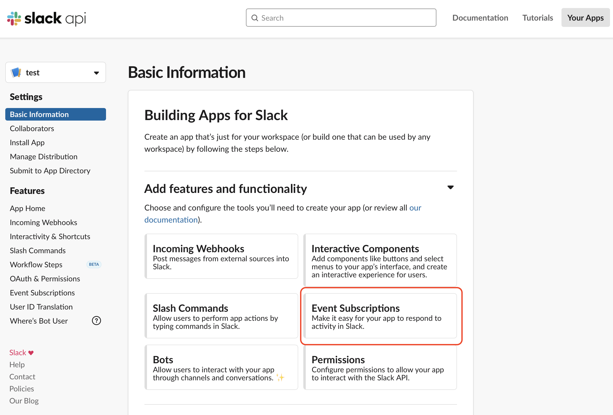
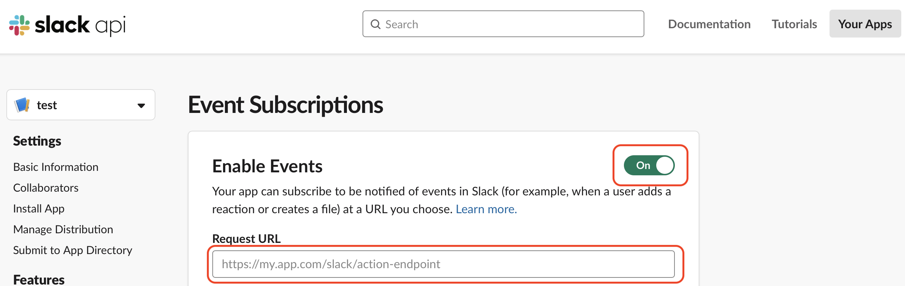
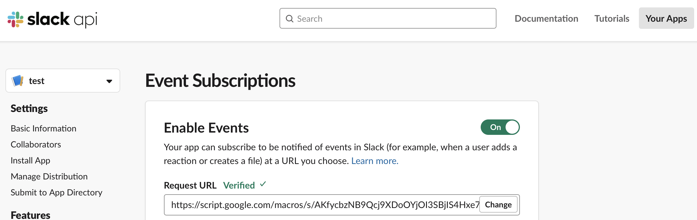
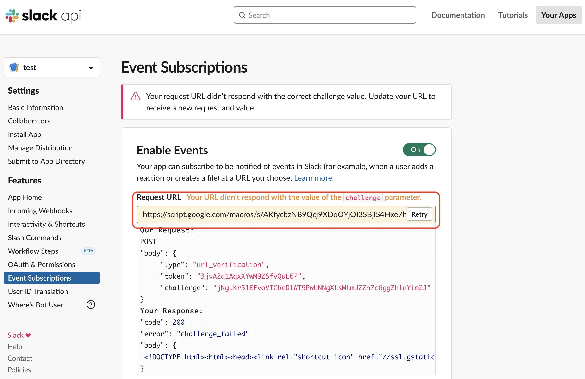
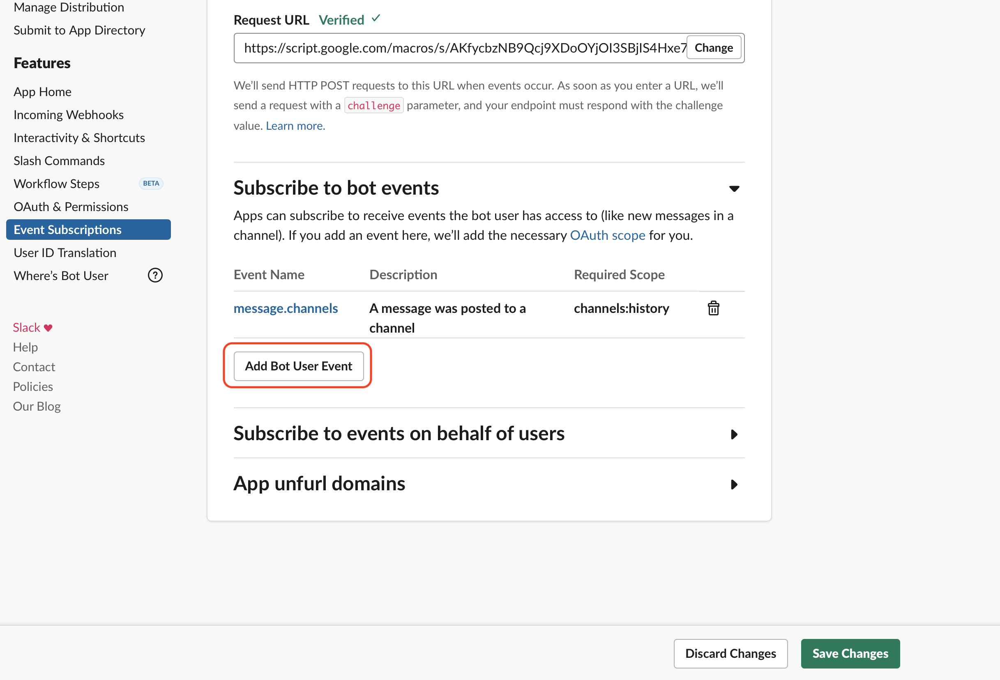
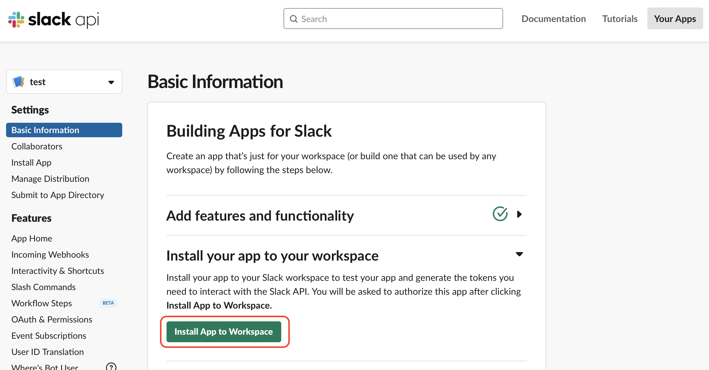

# gs-newliner

Add newline to Google Sheets by Google App Script via Slack app

## Usage

```zsh
$ clasp push
```

## Required

- npm or yarn
- clasp

## Setup

### Google App Script(GAS)

1. Select project  
   Open or Create GAS related to Google Sheets
   - [Open project](https://script.google.com/home)
   - Create
     1. `clasp create`
     2. `clasp push`
     3. `clasp open`
2. Deploy the script as a web app

   - Project version: **New**  
     No update if don’t select **New**
   - Execute the app as: **Me**
   - Who has access to the app: **Anyone, even anonymous**

   
   

3. Keep the web app URL
   - `https://script.google.com/macros/...`

### Slack apps

1. [Access Your Apps](https://api.slack.com/apps)
2. Create new apps

   - App Name
   - Development Slack Workspace

   

3. Enable Event Subscriptions  
   
   1. Turn on the switch for Enable Events
   2. Input the wep app URL of GAS kept via Setup GAS  
      
      - Verified!!!  
        
      - Errored  
        If errored, check `doPost` function of GAS whether return request parameter in json format
        
   3. Subscribe to bot events  
      Pick the right permission (recommended `message.channels`)  
      
   4. Save changes
4. Install App to Workspace  
   

5. Invite the bot to a channel
